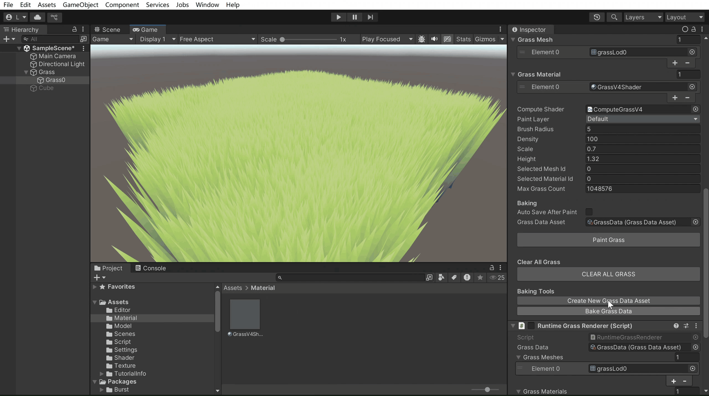

# TA-Portfolio-2025
2025年

仿terrian自带刷草工具的Mesh刷草工具 ： 支持Gpu instancing + 顶点着色器风场 + 一键烘培

挂载脚本GrassPainV4，设置相关参数点击paingrass即可在编辑模式进行绘制。

点击烘焙可以将数据烘培到指定asset中。

在挂载了RuntimeGrassRenderer脚本的mesh上，指定GrassDataAsset，调节Height，可以在运行模式下看到asset中的草 + computeshader视锥剔除 + 距离移除 + 多人交互。

着色器控制整体风场效果+computeshader控制单株草摆动

运行结果：

性能测试：

处理器：13th Gen Intel(R) Core(TM) i5-13500H (2.60 GHz)；
机带RAM：16.0 GB；
集成显卡：128MB；

5w规模简单模型草（单株顶点数13）
相机距离80m帧频稳定在170左右
相机距离30m帧频稳定在95左右

一些注意事项：
另外不同草地需要使用不同的材质，否则后用草地更改的材质数据会覆盖前者。
旧工程残留 JobSystem 剔除逻辑，所以需配置相关包才能正常运行，或者可以自行删除RuntimeGrassRenderer脚本中的Job system相关内容。
目前工具一次仅支持使用一种mesh + material进行刷草操作（待改进）。
视锥剔除和交互效果仅仅在RuntimeGrassRenderer脚本中实现。
